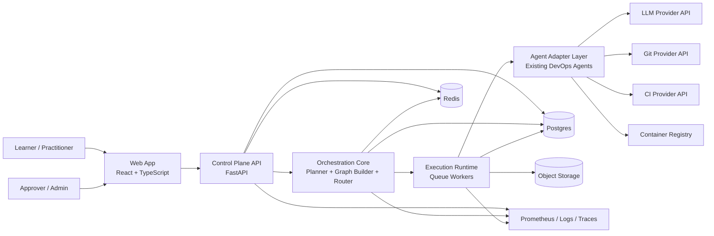
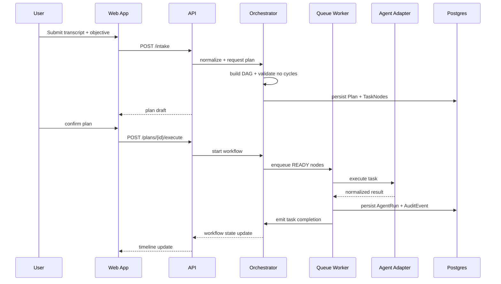
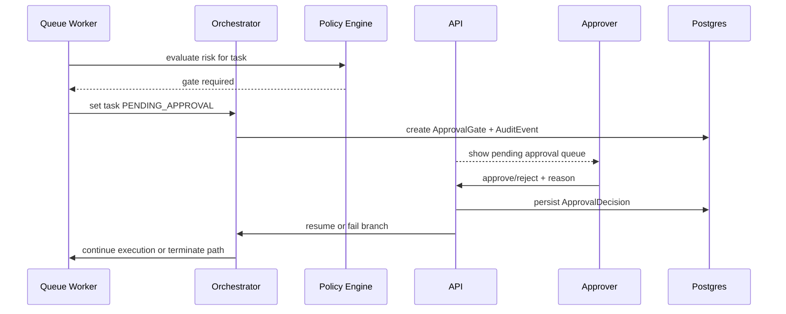
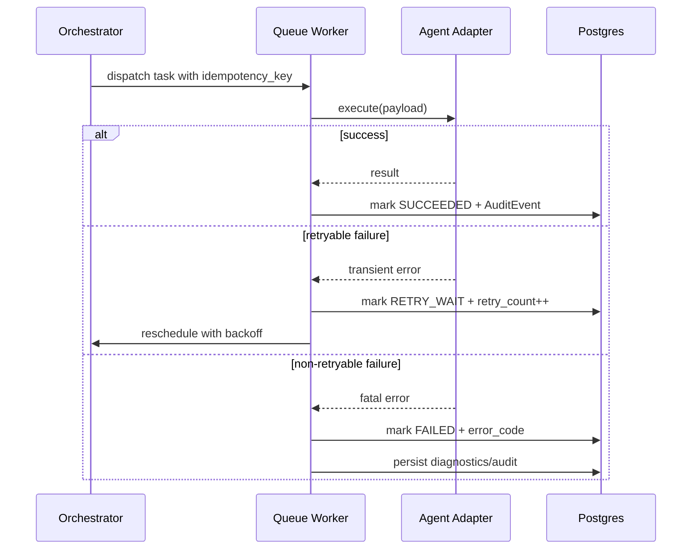
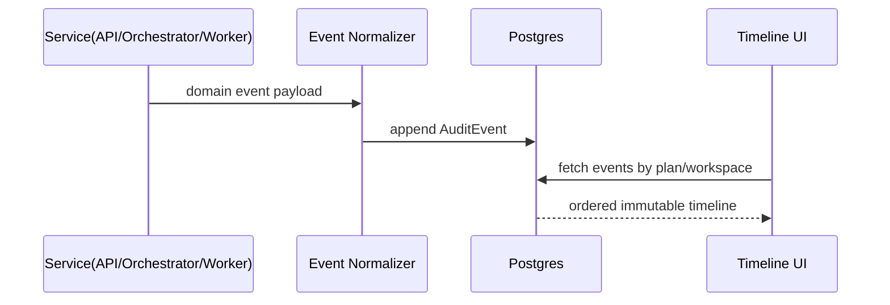

# Architecture Design Draft (Phase 3 / MVP)

## 1) System Context Diagram

### Boundary
- **Inside boundary:** Web App, Control Plane API, Orchestration Core, Workers, Agent Adapters, Postgres, Redis, Object Storage.
- **Outside boundary:** LLM provider, Git providers, CI providers, container registries, human actors.

## 2) Component Architecture

### 2.1 API Layer (FastAPI)
- AuthN/AuthZ (JWT + RBAC).
- Intake APIs (project input, transcript upload metadata).
- Plan APIs (create/edit/confirm plan).
- Execution APIs (start/stop/resume workflow).
- Approval APIs (queue, approve/reject/request changes).
- Audit/Timeline APIs (event stream, rationale replay).

### 2.2 Orchestration Core
- **Planner:** transforms intake into structured task intents.
- **Graph Builder:** creates DAG, validates acyclic dependencies.
- **Policy Engine:** evaluates risk + decides approval gates.
- **Router:** maps capability requirements to agent registry entries.
- **Executor Controller:** dispatches jobs to queue runtime and manages state transitions.

### 2.3 Execution Runtime
- Queue-backed workers process `TaskNode` jobs.
- Enforces idempotency key checks before side effects.
- Applies retry + exponential backoff + circuit breaker policy.
- Emits normalized domain events to audit stream.

### 2.4 Storage Layer
- **Postgres:** source of truth (plans, nodes, approvals, audit events, progress).
- **Redis:** queue backend, distributed locks, rate counters, cache.
- **Object Storage:** large artifacts (logs, generated files, transcript chunks).

### 2.5 Knowledge/Context Retrieval
- Pulls prior workspace artifacts, run history, and selected templates.
- Retrieves curated training rationale snippets for explainability.
- Uses deterministic template-first prompts before LLM expansion.

## 3) Data Model Sketch

### Core Entities
- **Workspace:** tenant boundary and policy defaults.
- **Plan:** user-approved execution plan linked to workspace.
- **TaskNode:** executable unit with status/retry/idempotency controls.
- **TaskEdge:** dependency graph relation between task nodes.
- **AgentRegistryEntry:** capability + version + contract schemas.
- **AgentRun:** execution record for a task attempt.
- **ApprovalGate / ApprovalDecision:** policy hold and human decision trail.
- **AuditEvent:** append-only immutable event stream.
- **LearningModule / ModuleProgress:** training content + learner progression.

### Key Relationships
- Workspace 1..N Plans
- Plan 1..N TaskNodes
- TaskNodes N..N via TaskEdges
- TaskNode 1..N AgentRuns
- TaskNode 0..1 ApprovalGate
- ApprovalGate 1..N ApprovalDecisions
- Workspace 1..N AuditEvents

## 4) Sequence Diagrams (Critical Flows)

### 4.1 Transcript -> Plan -> Execution

### 4.2 Approval Gate Workflow

### 4.3 Agent Execution with Retry/Failure

### 4.4 Audit Event Capture

## 5) Failure Mode Matrix

| Scenario | Detection | Immediate Handling | Recovery Path | Audit Requirement |
|---|---|---|---|---|
| LLM garbage output | Output schema validation fails | Mark `FAILED_VALIDATION`; block side effects | Retry with stricter template, then require human edit | Store prompt hash, output hash, validation errors |
| Agent crash mid-execution | Worker timeout/process exit | Set `RETRY_WAIT` if retry budget remains | Resume via idempotency key; otherwise manual intervention task | Persist crash signature + retry timeline |
| Large transcript upload | Request size threshold / streaming guard | Return 413 with chunk-upload path | Multipart/chunked upload + async preprocess job | Record rejected payload metadata + actor |
| Dependency loop in graph | DAG validation during plan build | Reject plan before execution | Planner regeneration with cycle diagnostics | Persist cycle diagnostics in audit |
| External API outage | Circuit breaker open + health checks | Fast-fail retryable tasks | Cooldown + backoff + fallback provider/manual path | Persist outage window + affected nodes |
| Approval timeout | SLA timer breach on gate | Keep workflow paused; escalate | Notify backup approver or policy auto-cancel | Persist escalation + timeout reason |

## 6) Agent Registry + Migration Strategy

### Existing Agents
- `build_predictor_agent`
- `code_review_agent`
- `github_actions_agent`
- `dockerfile_agent`
- `build_status_agent`
- `chat_agent`

### Adapter Contract
Each agent wrapped behind:
- `validate_input(payload) -> ValidatedPayload`
- `execute(payload, context) -> RawResult`
- `validate_output(result) -> NormalizedResult`
- `classify_error(error) -> retryable|fatal`

### Migration Plan
1. Introduce registry table with capability/version/schema fields.
2. Build adapters incrementally; keep existing endpoint paths intact.
3. Route new orchestration flows via adapters while legacy direct calls remain supported.
4. Add contract tests + canary rollout by capability flag.
5. Remove legacy direct coupling after parity metrics pass.

### Backward Compatibility
- Preserve existing route payloads/responses.
- Version contracts (`v1`, `v2`) in registry metadata.
- Maintain dual-path execution during transition window.

## 7) Technology Stack Decision Record (ADR Summary)

### ADR-001: FastAPI for Control Plane
- **Decision:** FastAPI.
- **Why:** Typed contracts (Pydantic), async I/O, strong testability, existing project alignment.
- **Rejected alternatives:** Flask (less typed by default), Django (heavier for control plane).

### ADR-002: Postgres as System of Record
- **Decision:** Postgres.
- **Why:** transactional consistency for plan/task/approval states, mature indexing/querying.
- **Rejected alternatives:** NoSQL-first stores (weaker relational guarantees for DAG/approval joins).

### ADR-003: Redis for Queue + Cache
- **Decision:** Redis.
- **Why:** low-latency queue backend, distributed locks, rate counters, simple ops footprint.
- **Rejected alternatives:** DB-backed queue (higher contention/latency).

### ADR-004: Queue Runtime Choice (Celery over Temporal for MVP)
- **Decision:** Celery + Redis for MVP.
- **Why:** fast adoption, Python-native ecosystem, low setup overhead, sufficient for bounded workflows.
- **Deferred:** Temporal for post-MVP if long-running/high-compensation workflows outgrow Celery semantics.

### ADR-005: Frontend Framework
- **Decision:** React + TypeScript + Vite.
- **Why:** already present in repo, rapid UI iteration, strong DX/testing support.

## 8) Security, Performance, Observability Baselines

### Security
- JWT short-lived access + refresh rotation.
- RBAC (`learner`, `practitioner`, `approver`, `admin`).
- Strict input validation at all boundaries.
- Per-workspace quotas and rate limits.
- Append-only audit writes.

### Performance
- API p95 target <200ms for non-LLM endpoints.
- DB p95 target <100ms on indexed reads.
- Recommended indexes:
  - `task_nodes(plan_id, status)`
  - `approval_gates(status, requested_at)`
  - `audit_events(workspace_id, occurred_at)`

### Observability
- Structured logs with `request_id`, `workspace_id`, `plan_id`, `task_id`.
- Metrics: latency, success/failure rate, queue depth, retries, approval backlog, token spend.
- Endpoints: `/healthz`, `/readyz`, `/metrics`.

## 9) Implementation Sequence
1. Add schema/migrations for plan graph, approvals, audit, registry.
2. Build orchestration core (planner + graph validator + router + executor controller).
3. Integrate Celery worker runtime and idempotent execution guards.
4. Migrate existing agents through adapter contracts + canary flags.
5. Implement approval APIs/UI queue and pause/resume semantics.
6. Add rationale event replay APIs for training mode.
7. Harden with integration tests, load checks, and security scanning gates.
